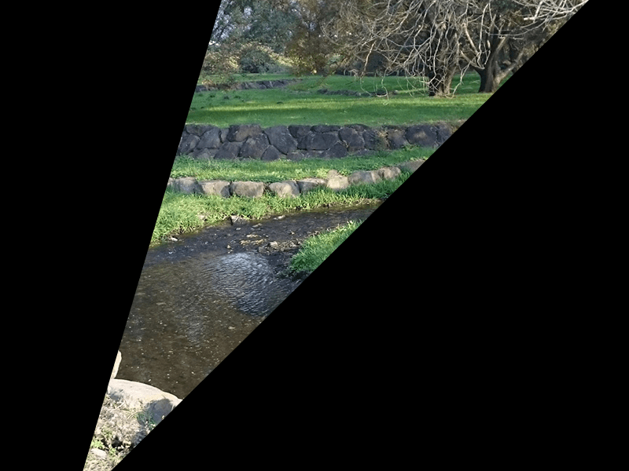
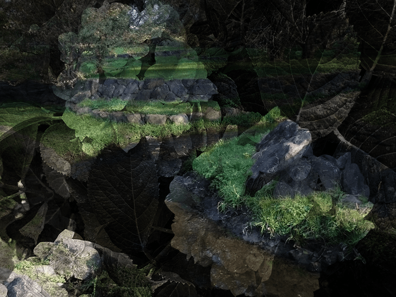

# pixi-mask-test

## Demo

https://okayumoka.github.io/pixi-mask-test/

## Run on local

```bash
npm install
npm start
# Available on localhost:8080
```

## Result

| Base | Mask | Result |
|------|------|--------|
||||
||||
||||
||||
||||
